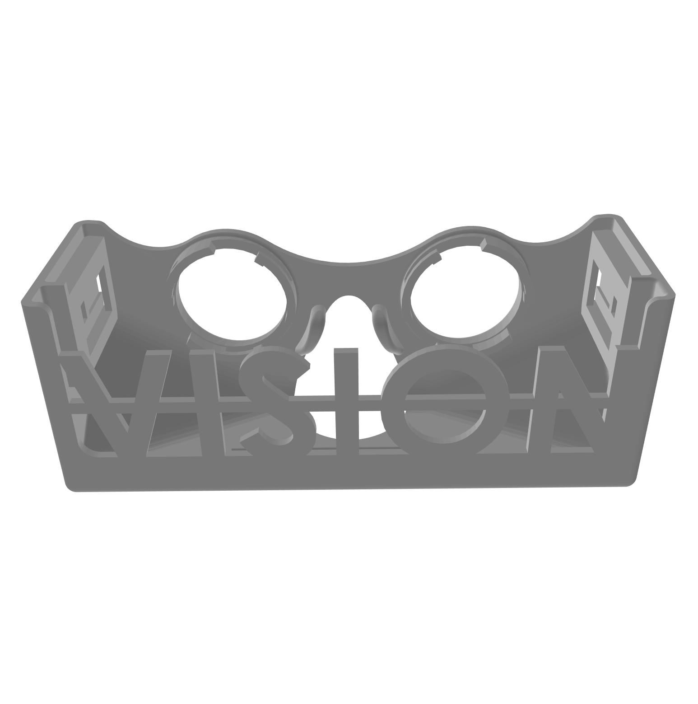
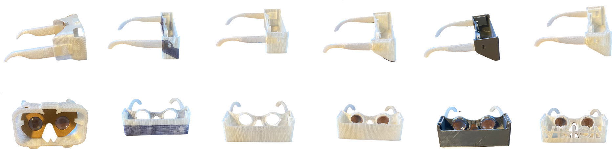
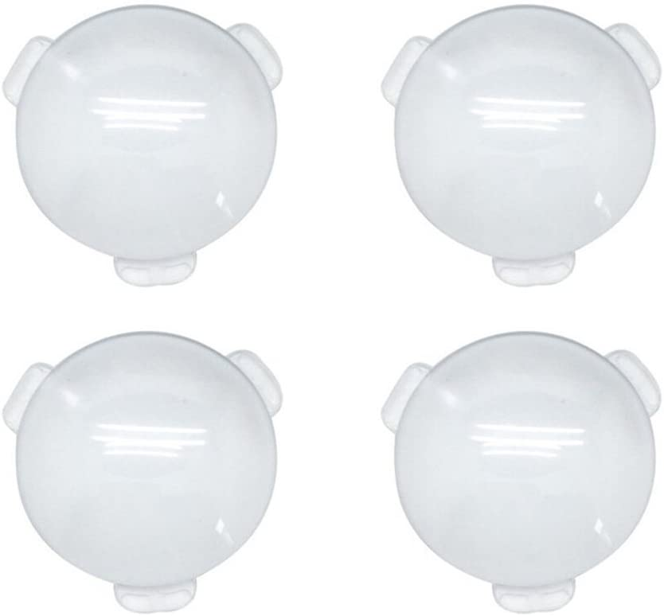

### Vision Smartphone Passthrough Glasses by Alex Ionkov

### [Github repo with source files](https://github.com/ionif/visionglasses)
### [Project website](https://ionif.github.io/vision/)
### [Cults3D link](https://cults3d.com/en/3d-model/gadget/wearable-google-cardboard-glasses-vison-smartphone-mixed-reality-glasses)
### Goal

The goal of this project is to opensource Google Cardboard style glasses for WebXR development and use. Currently compatible with WebXR (WebVR), Aframe, Google Cardboard. Fits the iPhone 11, X or any phone of similar dimension (~5.95" by ~2.95" by ~0.35").

* * *

I'm currently also using Google Mediapipe Handpose model to try and implement handtracking using the rear camera of the phone. The smartphone is powerful enough for these experiences but it hasn't really been harnessed yet.

### Design and Prototyping

Each step of the prototyping and design process. All prototypes were printed in FDM.

The ear support pieces are removable which means you can print multiple headsets for different phones and use the same ear support pieces for every one. Also allows you to travel with it easier.

#### Lenses

Here's the [Amazon link](https://www.amazon.com/gp/product/B074WPTTX8/ref=ppx_yo_dt_b_asin_title_o03_s00?ie=UTF8&psc=1).  
For lenses, I found the lenses another headset on Thingiverse used: [Link](https://www.thingiverse.com/thing:2946977). I used the same design for how the lenses locked into their headset; it's a really cool way to lock them in. The focal length is 45 mm which just means the distance between lense and phone needs to be 45 mm.

#### Acknowledgements

Chris Meyer at [Sector67](http://www.sector67.org/blog/), a local makerspace, was amazing to work with and more than happy to help me. He helped me understand the limits of FDM and other materials. His knowledge and experience helped me immensely. I wasn't allowed to use my university's (UW Madison) makerspace for personal projects.

### Info

I worked on this project during the Fall of 2020. Design and development till the last prototype took two months from the end of September to the end of November.

### Contribution

Anyone interested in adjusting the models for other phones is welcome to! It would be awesome, if you create a push request afterwards, with the changes in a branch named the specific model phone! Remixes are welcome but must be open source as well however, due to the GPLv3 license.

To check out more of my projects, visit my [website](https://ionif.github.io/vision/) or [Github](https://github.com/ionif).
